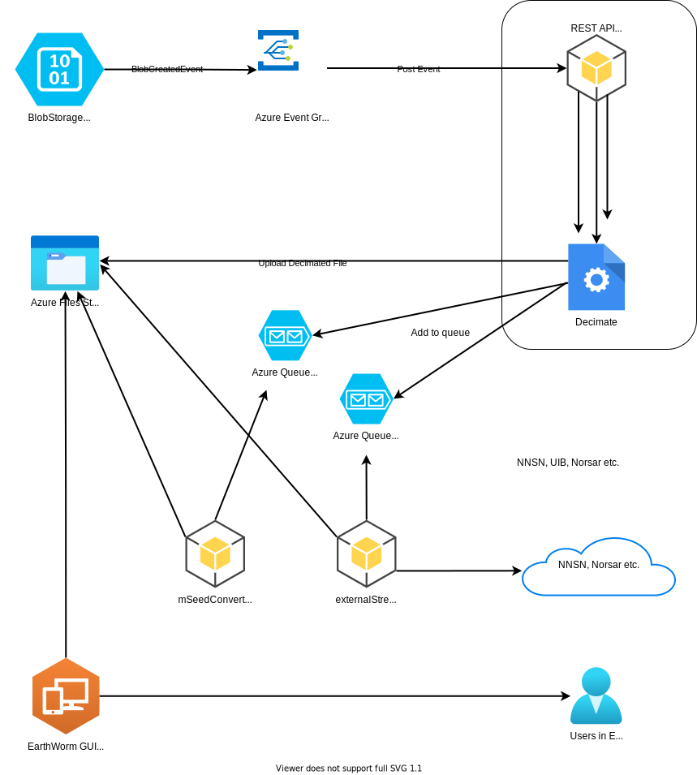

# CCS-Passive

_Seismic data processing workflow_

## What is CCS-Passive

A workflow for processing raw segy/su seismic files into a more managable and monitoring friendly miniSeed format.

## Architecture



1. The data source - The offshore operators upload raw siesmic data near real-time
2. The Azure Storage Account is configured to send an HTTP post request on creation of new blobs
3. A FastAPI web server running in Omnia Radix. Listening for events, and decimates any new files, uploading them to CCS-Passive's Azure File Storage
4. A message is added to the Convert Queue when a new file has been decimated
5. A python wrapper for a C++ program that downloads decimated files, covert them to miniSeed, and uploads them to the File Share
6. A Ubuntu virtual machine running SeisComp's seedlinktool to stream miniseed data both up and down
7. Data to external networks are streamed via seedlink through a Wireguard VPN tunnel
8. (Out of scope) Equinor consumers of the data can connect to the seedlink server

## Notable Dependencies

- Decimate - Used to extract given traces from segd files - <https://git.equinor.com/sentry/decimate>

## Notes

### slinktool usage

<https://github.com/iris-edu/slinktool/blob/master/doc/slinktool.md>

List stations:

``` bash
slinktool -Q 10.1.0.2
```

Format all stations to the slinktool stream selector

```bash
slinktool -Q 10.1.0.2 | cut -d " " -f 1-2 | uniq | sed "s|\ |_|g" | sed -z 's/\n/,/g'
```

So slink command looks like;

```bash
slinktool -S 'NS_ASK,<...>,NS_VBYGD' -SDS /ccs-passive/mseed/nnsn 10.1.0.2
```
